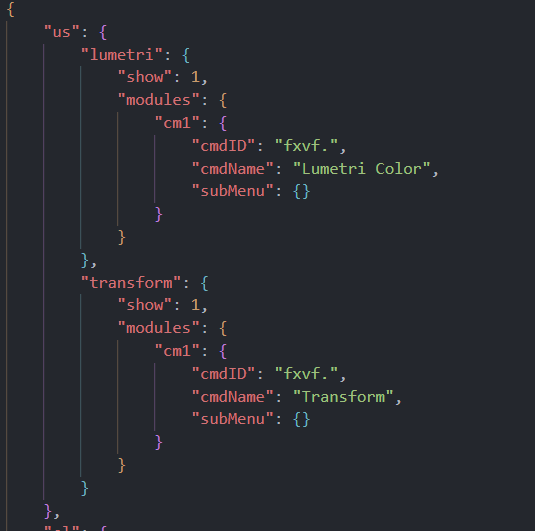

If you encounter issues where excalibur isn't showing results, chances are it has accidentally created a duplicate key value in `.cmdlist.json`

The best way to resolve this issue is to backup your current file found;  
[win]: `C:\Users\%username%\AppData\Roaming\Knights of the Editing Table\excalibur\.cmdlist.json`  
[mac]: `/Users/%username%/Library/Application Support/Knights of the Editing Table/excalibur/.cmdlist.json`

Then;
- delete that file & restart premiere. 
- open a project and it should generate a new file.

If you had custom commands;
- open up your backed up version and at the top you will find a section labelled `"us"` (you may need to "format document" in vscode to be able to more easily read it)
- copy that section and replace the empty `"us"` section in the newly generated file.
- restart premiere

