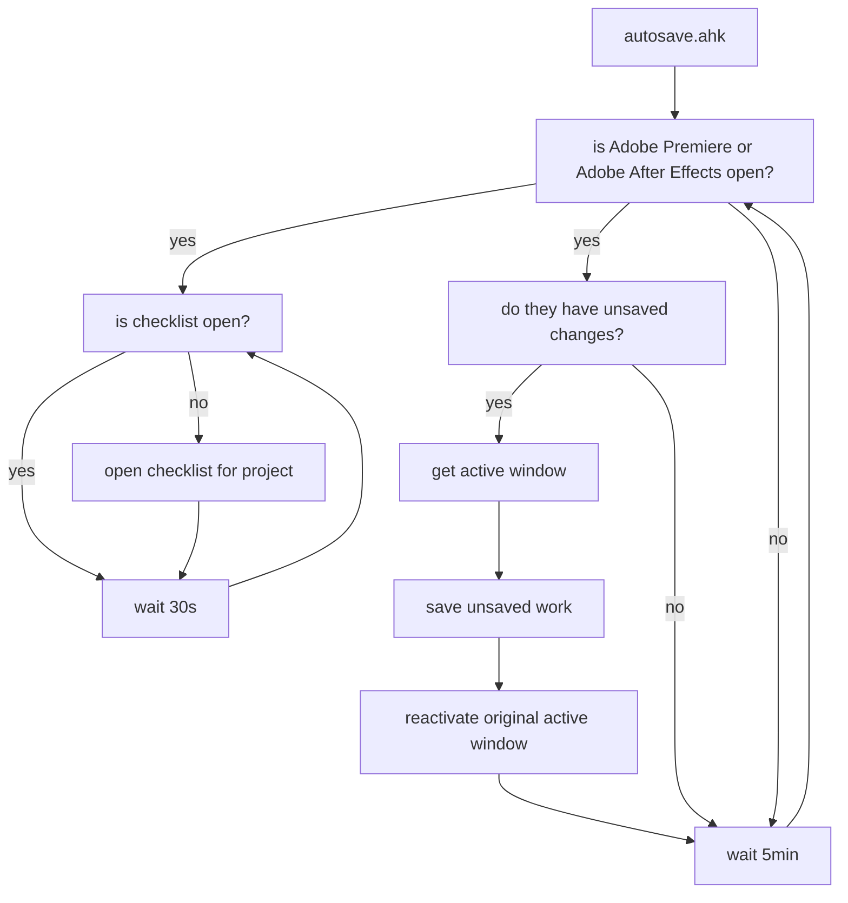

Adobe products are notoriously known for their instability and overall untrustworthy behaviour. After losing one too many projects to a crash only to find autosave hadn't actually saved at all in the last 30 minutes, I looked to find a solution.

`autosave.ahk` is that solution.

This script holds two main functions;

- Autosave `unsaved` work every `5min`.
- Make sure `checklist.ahk` is open.

First up, this script will grab information about the active window so we can reactivate it later, it will then check the title of any open `Premiere Pro` and `After Effects` window for a little `*` - an asterisk indicates that changes have been made and aren't saved. It will then save the windows that need saving before prompty returning focus to the originally active window.

If premiere was the original active window and you were playing back footage on the timeline, this script should begin playback again once saving is complete. If you were playing back spedup, unfortunately there's no way to distinguish that and only normal speed playback can be returned.

