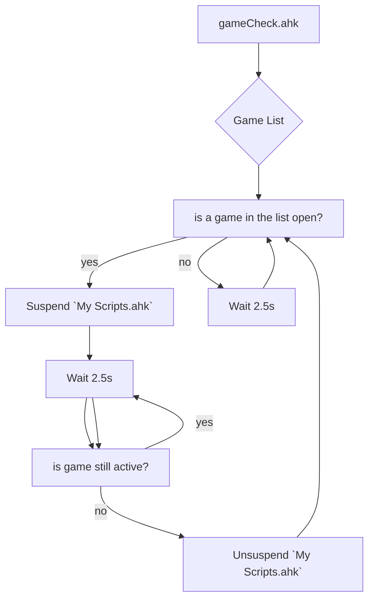

`My Scripts.ahk` contain a lot of macros that perform a lot of interesting and useful tasks. A lot of those macros are bound to mouse buttons and a lot of them are designed to manipulate windows around the desktop.

Games don't like when you try to do that and try their best to suppress those macros all while you're left wondering why you can't seem to aim down the sights of your gun.

`gameCheck.ahk` aims to smooth that experience over for you by cross referencing the active window against a list of games input by the user. If the active window matches of of the games in the list, `My Scripts.ahk` will be automatically suspended, the script will then wait until either the game is shut, or you `alt + tab` out.

You can add games to this list by either;

- Manually adding them (not recommended)
- Right clicking `gameCheck()'s` tray icon in the taskbar
- Pulling up `settingsGUI()` (`#F1` by default) and pressing the `Add game to 'gameCheck.ahk'` button
    - Using this method will have the boxes autofilled with the necessary information assuming you pulled up the GUI while the game was active

If you have to resort to adding games manually, use `WindowSpy` it comes alongside ahk!

