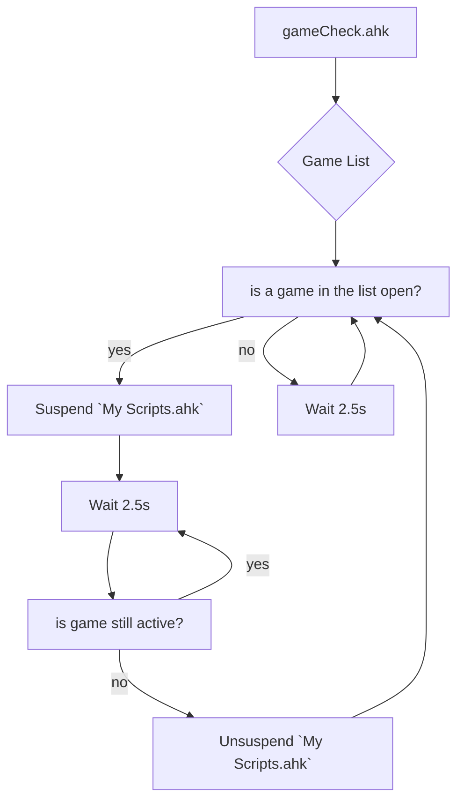

<div align="center">

# [](https://github.com/Tomshiii/ahk/tree/main) ahk
[](https://github.com/tomshiii/ahk/releases/latest) [](https://github.com/Tomshiii/ahk/commits/dev) [](https://github.com/tomshiii/ahk/blob/main/LICENSE)
</div>

This repo is a combination of all the scripts I use almost daily to help with either making content (videos or streaming related), or just speeding up mundane and random interactions with a computer.

- Video walking through [how to make sense of this repo](https://youtu.be/4qakIF4Vins)
- Video going over how AHK can help speed up [editing workflows](https://youtu.be/Iv-oR7An_iI)

A lot of the code in the earliest versions of my scripts was either inspired by, or taken from [Taran (previous editor for LTT)](https://github.com/TaranVH/). His videos on ahk got me into fiddling around with it myself. These scripts were then further elaborated on, transformed into `ahk v2.0` compliant scripts and now mostly contains my own tinkerings with a sprinkle of additional libraries.

> [!Important]
> *A lot* of the development for this repo happens in the [dev](https://github.com/Tomshiii/ahk/tree/dev) branch before making its way into a release and these changes can remain over there for months at a time. I recommend checking out any [changes](https://github.com/Tomshiii/ahk/blob/dev/changelog.md) over there in case of important fixes, as well as the [Known Issues](https://github.com/users/Tomshiii/projects/2) and [Planned Changes](https://github.com/users/Tomshiii/projects/1) project pages to see if any small bugs/changes are currently being tracked/worked on.  
> ***However*** do be aware that the dev branch **is** in active development and any number of bugs/issues may still be present as I continue to iron things out.

***

## [Getting Started:](https://github.com/Tomshiii/ahk/wiki)

Depending on which sections of my repo you intend to use will determine how much manual setup is required from the user; For indepth instructions on how to get started with my repo, alongside any important notices head [over to the wiki page](https://github.com/Tomshiii/ahk/wiki).  
There you will also find complete definitions of all scripts/functions of my repo, important prerequisite information that is required of the user before my repo will function as expected, as well as detailed [installation instructions](https://github.com/Tomshiii/ahk/wiki/Installation).

### AHK Version Information:
This repo is to maintain work on the `ahk v2.0` versions of my scripts.
> [!Caution]
> These scripts will not work in `ahk v1.1`
***

## Short Explanation:

#### [Libs](https://github.com/Tomshiii/ahk/tree/main/lib/)
In this section of the repo you will find a collection of lib files containing helpful functions, classes, GUIs & more! Some scripts rely on other lib files to function properly so make sure you pay attention to the top of each script, if it has any `#Include <lib\path>` then you will also need that file for the script to function properly!  
If you ever notice any inconsistencies in any scripts (say a script *should* have an include listed but it doesn't) please be sure to raise an issue here on github so I can get it fixed.

#### [Keyboard Shortcuts.ini/Keyboard Shortcut Adjustments.ahk](https://github.com/Tomshiii/ahk/tree/main/Support%20Files/KSA)
An ini file/ahk script combo for defining all keyboard shortcuts for programs that are then used within other scripts. Having them defined separately in an ini file allows for easy swapping of hotkeys without needing to dig through each and every macro/function that uses it. You do NOT need to run this ahk file, it is [`#Include(d)`](https://lexikos.github.io/v2/docs/commands/_Include.htm) in all scripts that require it.

#### [My Scripts.ahk](https://github.com/Tomshiii/ahk/blob/main/My%20Scripts.ahk)
This script is the "central" script if you will. A lot of my windows scripts are here (and a hand full of scripts I use for editing).

This script will also go through a lot of important functions on boot. Some go through their function every boot of the script while some are more conditional. These `startup` functions are contained within a class `startup {` and are as follows;
- `generate()` - Handles creating a new `settings.ini` file each new release. The `settings.ini` file will be located in `A_MyDocuments \tomshi\`. These settings can be adjusted by right clicking on `My Scripts.ahk` and clicking `Settings` or by pulling up `settingsGUI()` (default hotkey is <kbd>win + F1</kbd>)
- `updateChecker()` - Checks github to see if there is a new version of my scripts available and can automatically download it for you as well as backup your current script directory
- `updatePackages()` Checks for updates to packages installed through the `choco` package manager
- `trayMen()` - Adds some tray menu items to the right click menu of `My Scripts.ahk`
- `firstCheck()` - Will check to see if this is the first time you're running my scripts and offer a helpful GUI to run you through a few things to get you going.
- `oldLogs()` - Will remove logs in `..\Logs\Error Logs\` & `..\Logs\Other Logs\` older than 30 days
- `adobeTemp()` - Will scan your adobe temp folders and delete them if they're larger than the user adjustable setting. This function also contains a custom folder for `After Effects` and will require the user to meddle with it for full functionality
- `adobeVerOverride()` - Will optionally check the user's current `Adobe Premiere` and `Adobe After Effects` installed `.exe` files to ensure the version number lines up with what they've set in `settingsGUI()`
- `libUpdateCheck()` - Will check all external lib files to see if they're up to date
- `updateAHK()` - Will check for and alert the user of a new version of AutoHotkey
- `monitorAlert()` - Will alert the user of any changes to their monitor layout so they can be aware that some hotkeys might not work as expected

#### [QMK Keyboard.ahk](https://github.com/Tomshiii/ahk/blob/main/QMK%20Keyboard.ahk)
My scripts have support for a secondary keyboard with [[QMK Keyboard.ahk]](https://github.com/Tomshiii/ahk/blob/main/QMK%20Keyboard.ahk) which along with the [`Hasu USB-USB converter`](https://geekhack.org/index.php?topic=109514.0) **OR** `a custom keyboard` (with `custom firmware`), allows you to use a secondary keyboard or numpad to launch completely different scripts than your main keyboard following [this tutorial by Taran from LTT](https://www.youtube.com/watch?v=GZEoss4XIgc). Any macros that have been moved to this script can be pulled out and placed in your own scripts without any issues.  
[QMK Keyboard.ahk](https://github.com/Tomshiii/ahk/blob/main/QMK%20Keyboard.ahk) is therefor a script to allow separate function for my secondary keyboard. A script originally created by [Taran](https://github.com/TaranVH/) that I've heavily modified to work for my own workflow and to function in ahk v2.0 (and cut down to only applicable buttons). Up until [Release v2.2.5.1](https://github.com/Tomshiii/ahk/releases/tag/v2.2.5.1) I used a small seconday numpad, but as of [Release v2.3+](https://github.com/Tomshiii/ahk/releases/tag/v2.3) I use a `Planck Ez` custom keyboard.
Check out [\Secondary Keyboard Files](https://github.com/Tomshiii/ahk/tree/main/Support%20Files/Secondary%20Keyboard%20Files) for more information on how that works.

#### [gameCheck.ahk](https://github.com/Tomshiii/ahk/blob/main/Timer%20Scripts/gameCheck.ahk)
A script that will automatically suspend `My Scripts.ahk` when a game is detected to be the active window & then unsuspend it when the game is no longer active.


#### [autosave.ahk](https://github.com/Tomshiii/ahk/blob/main/Timer%20Scripts/autosave.ahk)
A script that will automatically save an Adobe Premiere Pro/After Effects project every 5min (if there have been unsaved changes) because Adobe's built in autosave is practically useless and fails to function a lot. This script contains optional code to use [`PremiereRemote`](https://github.com/Tomshiii/ahk/wiki/PremiereRemote) instead of only ahk.

#### [checklist.ahk](https://github.com/Tomshiii/ahk/blob/main/checklist.ahk)
A script that allows me to keep informed about what I have left to do on a video editing project as well as keeping track of the hours I've put into any individual project. This file gets run from this directory and then reads an autogenerated `checklist.ini` file in your project folder.

#### [Multi-Instance Close.ahk](https://github.com/Tomshiii/ahk/blob/main/Timer%20Scripts/Multi-Instance%20Close.ahk)
A script that will periodically check for duplicate instances of any autohotkey scripts and close one of them. Even if you use `#SingleInstance Force` reloading scripts can sometimes cause a second instance to slip open. This script will hopefully mitigate the odd behaviour that occurs when this happens by closing any duplicates.

#### [PC Startup.ahk](https://github.com/Tomshiii/ahk/blob/main/PC%20Startup/PC%20Startup.ahk)
A script that is run on PC startup to launch all my AHK scripts, as well as deal with some programs I need.

#### [Resolve_Example.ahk](https://github.com/Tomshiii/ahk/blob/main/lib/Apps/Editors/Resolve.ahk)
An example script for Davinci Resolve that has ported a few things from my premiere scripts to help you get started. This is very rough, thrown together and contains nowhere near the same amount of features.

#### [Alt_menu_acceleration_DISABLER.ahk](https://github.com/Tomshiii/ahk/blob/main/Timer%20Scripts/Alt_menu_acceleration_DISABLER.ahk)
A script from [Taran](https://github.com/TaranVH/) to disable the alt menu acceleration unless you _hold_ down the alt key.

#### [Premiere_RightClick.ahk](https://github.com/Tomshiii/ahk/blob/main/lib/Classes/Editors/Premiere_RightClick.ahk)
A script originally from [Taran](https://github.com/TaranVH/) to [move the playhead](https://github.com/TaranVH/2nd-keyboard/blob/master/Taran's_Premiere_Mods/PREMIERE_MOD_Right_click_timeline_to_move_playhead.ahk) in premiere with the right mouse button. This script has been heavily altered and now contains mostly my own code.

#### [\Error Logs](https://github.com/Tomshiii/ahk/tree/main/Logs/Error%20Logs)
Anytime a macro/script encounters an error it will be logged in a txt file in this directory to help you catch anything that isn't working as intended so that in the event that the tooltip disappears too quickly, you can still dig in and see everything going on.

Eg.
```
15:58:38.367 // `audioDrag()` encountered the following error: "User hasn't opened the required bin"
// Script: `My Scripts.ahk`, Line: 643
```
***
> [!Tip]
> Plenty more scripts can be found within this repo, feel free to check out the [wiki page](https://github.com/Tomshiii/ahk/wiki/Home) or just browse around for more!
