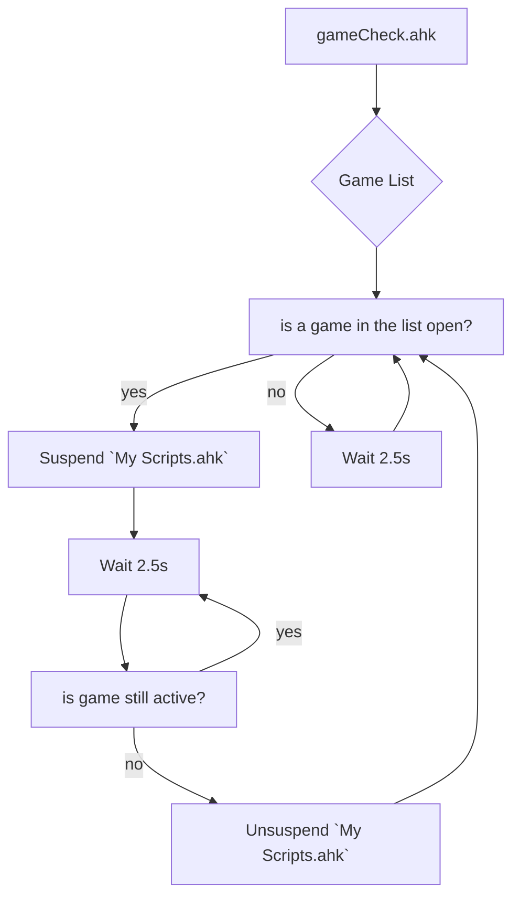
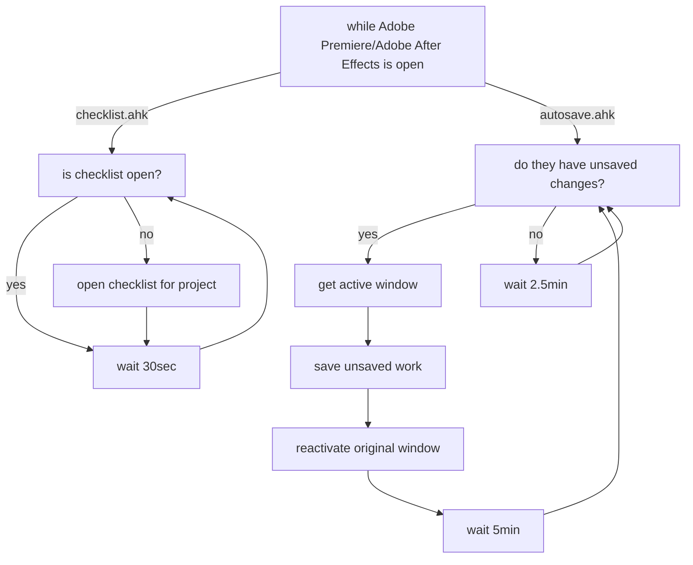

<div align="center">

# [](https://github.com/Tomshiii/ahk/tree/main) ahk
[](https://github.com/tomshiii/ahk/releases/latest) [](https://github.com/Tomshiii/ahk/commits/dev) [](https://github.com/tomshiii/ahk/blob/main/LICENSE)
</div>

This repo is a combination of all the scripts I use almost daily to help with either making content (videos or streaming related), or just speeding up mundane and random interactions with a computer.

- Video walking through [how to make sense of this repo](https://youtu.be/4qakIF4Vins)
- Video going over how AHK can help speed up [editing workflows](https://youtu.be/Iv-oR7An_iI)

<div align="center">

[ ](https://www.youtube.com/c/tomshiii)
</div>

A lot of the code in the earliest versions of my scripts was either inspired by, or taken from [Taran (previous editor for LTT)](https://github.com/TaranVH/). His videos on ahk got me into fiddling around with it myself so many thanks. These scripts were then further elaborated on, transformed into `ahk v2.0` compliant scripts and now mostly contains my own tinkerings. Any scripts directly from Taran are labeled as such down below in the Explanation section (do note though that I have personally gone through them to make them function in `ahk v2.0`).

You can watch me use some of these scripts in action whilst I edit away on twitch when I stream on my bot account:

<div align="center">

[ ](https://www.twitch.tv/botshiii)
</div>

### AHK Version Information:
This repo is to maintain work on the `ahk v2.0` versions of my scripts. These scripts **_will not_** work in `ahk v1.1`, the only versions of these scripts that will work with `ahk v1.1` are Releases [1.0](https://github.com/Tomshiii/ahk/releases/tag/v1.0)/[1.1](https://github.com/Tomshiii/ahk/releases/tag/v1.1)/[1.2](https://github.com/Tomshiii/ahk/releases/tag/v1.2) in this repo. They are _severely_ outdated, are practically missing everything found in the current versions of scripts, and those versions are no longer being maintained but you're free to try and backport any later additions if you're willing.

## QMK Keyboard:
My scripts have support for a secondary keyboard with [[QMK Keyboard.ahk]](https://github.com/Tomshiii/ahk/blob/main/QMK%20Keyboard.ahk) which along with the [`Hasu USB-USB converter`](https://geekhack.org/index.php?topic=109514.0) **OR** `a custom keyboard` (with `custom firmware`), allows you to use a secondary keyboard or numpad to launch completely different scripts than your main keyboard following [this tutorial by Taran from LTT](https://www.youtube.com/watch?v=GZEoss4XIgc). Any macros that have been moved to this script can be pulled out and placed in your own scripts without any issues.
***

## [Getting Started:](https://github.com/Tomshiii/ahk/wiki)

> ### Before Getting Started
> My scripts rely on a `SymLink` to be created in the `A_MyDocuments \AutoHotkey\` folder that links back to `..\lib`. The install `.exe` can do this during the extraction process ***OR*** you can regenerate it manually (if you move my repo this also **MUST** be regenerated) by running [`..\Support Files\Release Assets\CreateSymLink.ahk`](https://github.com/Tomshiii/ahk/wiki/CreateSymLink.ahk). My scripts will fail to load if you do not do this.

> #### The Release Install `.exe`
> If you're a little unsure about running the install .exe (as you should be!) feel free to take a look at [`generateUpdate.ahk`](https://github.com/Tomshiii/ahk/blob/main/Support%20Files/Release%20Assets/generateUpdate.ahk) - this is the script I use to generate each release! As you'll be able to see within that script, I use the standard `ahk2exe` script that comes with AHK itself to compile a `.zip` of my repo alongside a lib contained in this repo to automatically unzip it once you install.
>> The install process will require either `7zip` to be installed or, `Powershell` and `.Net4.5 (or greater)`. If the user does not have either installed, the install process will step through installing `PowerShell` and `.Net4.X`

Indepth instructions on how to get started with my repo, as well as complete definitions of everything can be found [over on the wiki page](https://github.com/Tomshiii/ahk/wiki).
***

## Short Explanation:

#### [Keyboard Shortcuts.ini/Keyboard Shortcut Adjustments.ahk](https://github.com/Tomshiii/ahk/tree/main/lib/KSA)
An ini file/ahk script combo for defining all keyboard shortcuts for programs that are then used within other scripts. Having them defined separately in an ini file allows for easy swapping of hotkeys without needing to dig through each and every macro/function that uses it. You do NOT need to run this ahk file, it is [`#Include(d)`](https://lexikos.github.io/v2/docs/commands/_Include.htm) in all scripts that require it.

#### [My Scripts.ahk](https://github.com/Tomshiii/ahk/blob/main/My%20Scripts.ahk)
This script is the "central" script if you will. A lot of my windows scripts are here (and a hand full of scripts I use for editing).

This script will also go through a lot of important functions on boot. Some go through their function every boot of the script while some are more conditional;
- `generate()` - Handles creating a `settings.ini` file in `A_MyDocuments \tomshi\` directory that handles a few user adjustable settings in my scripts. These settings can be adjusted by right clicking on `My Scripts.ahk` and clicking `Settings` or by pulling up `settingsGUI()` (default hotkey is `win + F1`)
- `locationReplace()` - Handles replacing any instance of either my original working directory, or yours if you move my scripts to a new location. eg. on first run by the user this function will replace all instances of `E:\Github\ahk` with the directory you run the script
- `trayMen()` - Adds some tray menu items to the right click menu of `My Scripts.ahk`
- `updateChecker()` - Checks github to see if there is a new version of my scripts available and can automatically download it for you as well as backup your current script directory
- `firstCheck()` - Will check to see if this is the first time you're running my scripts and offer a helpful GUI to run you through a few things to get you going.
- `oldError()` - Will remove logs in `A_ScriptDir \Error Logs\` older than 30 days
- `adobeTemp()` - Will scan your adobe temp folders and delete them if they're larger than the user adjustable setting. This function also contains a custom folder for `After Effects` and will require the user to meddle with it for full functionality
- `libUpdateCheck()` - Will check all external lib files to see if they're up to date
- `updateAHK()` - Will check for and alert the user of a new version of AutoHotkey

#### [QMK Keyboard.ahk](https://github.com/Tomshiii/ahk/blob/main/QMK%20Keyboard.ahk)
A script to allow separate function for my secondary keyboard. A script originally created by [Taran](https://github.com/TaranVH/) that I've heavily modified to work for my own workflow and to function in ahk v2.0 (and cut down to only applicable buttons). Up until [Release v2.2.5.1](https://github.com/Tomshiii/ahk/releases/tag/v2.2.5.1) I used a small seconday numpad, but as of [Release v2.3+](https://github.com/Tomshiii/ahk/releases/tag/v2.3) I use a Planck Ez custom keyboard.
Check out [\Secondary Keyboard Files](https://github.com/Tomshiii/ahk/tree/main/Support%20Files/Secondary%20Keyboard%20Files) for more information on how that works.

#### [gameCheck.ahk](https://github.com/Tomshiii/ahk/blob/main/Timer%20Scripts/gameCheck.ahk)
A script that will automatically suspend `My Scripts.ahk` when a game is detected to be the active window & then unsuspend it when the game is no longer active.


#### [autosave.ahk](https://github.com/Tomshiii/ahk/blob/main/Timer%20Scripts/autosave.ahk)
A script that will automatically save an Adobe Premiere Pro/After Effects project every 5min (if there have been unsaved changes) because Adobe's built in autosave is practically useless and fails to function a lot. It will also check to ensure the `checklist.ahk` for the current project is open.


#### [checklist.ahk](https://github.com/Tomshiii/ahk/blob/main/checklist.ahk)
A script that allows me to keep informed about what I have left to do on a video editing project as well as keeping track of the hours I've put into any individual project. This file gets run from this directory and then reads an autogenerated `checklist.ini` file in your project folder. This script has an accompanying script in `\Support Files` that allows you to quickly replace any in use checklist files.

#### [Multi-Instance Close.ahk](https://github.com/Tomshiii/ahk/blob/main/Timer%20Scripts/Multi-Instance%20Close.ahk)
A script that will periodically check for duplicate instances of any autohotkey scripts and close one of them. Even if you use `#SingleInstance Force` reloading scripts can sometimes cause a second instance to slip open. This script will hopefully mitigate the odd behaviour that occurs when this happens by closing any duplicates.

#### [PC Startup.ahk](https://github.com/Tomshiii/ahk/blob/main/PC%20Startup.ahk)
A script that is run on PC startup to launch all my AHK scripts, as well as deal with some programs I need.

#### [Resolve_Example.ahk](https://github.com/Tomshiii/ahk/blob/main/lib/Apps/Editors/Resolve.ahk)
An example script for Davinci Resolve that has ported a few things from my premiere scripts to help you get started. This is very rough, thrown together and contains nowhere near the same amount of features.

#### [Alt_menu_acceleration_DISABLER.ahk](https://github.com/Tomshiii/ahk/blob/main/Timer%20Scripts/Alt_menu_acceleration_DISABLER.ahk)
A script from [Taran](https://github.com/TaranVH/) to disable the alt menu acceloration unless you _hold_ down the alt key.

#### [right click premiere.ahk](https://github.com/Tomshiii/ahk/blob/main/right%20click%20premiere.ahk)
A script originally from [Taran](https://github.com/TaranVH/) to [move the playhead](https://github.com/TaranVH/2nd-keyboard/blob/master/Taran's_Premiere_Mods/PREMIERE_MOD_Right_click_timeline_to_move_playhead.ahk) in premiere with the right mouse button. This script has been heavily altered and contains a large amount of my own code.

#### [\Error Logs](https://github.com/Tomshiii/ahk/tree/main/Error%20Logs)
Anytime a macro/script encounters an error it will be logged in a txt file in this directory to help you catch anything that isn't working as intended so that in the event that the tooltip disappears too quickly, you can still dig in and see everything going on.

Eg.
```
15:58:38.367 // `audioDrag()` encountered the following error: "User hasn't opened the required bin"
// Script: `My Scripts.ahk`, Line: 643
```
***
Plenty more scripts can be found within this repo, feel free to check out the [wiki page](https://github.com/Tomshiii/ahk/wiki/Home) or just browse around for more!