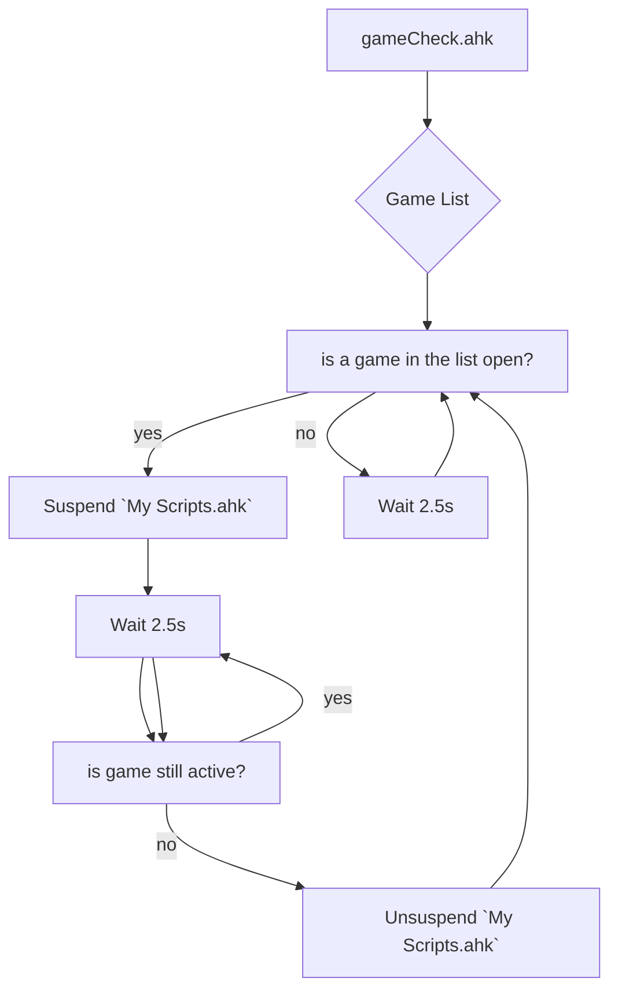
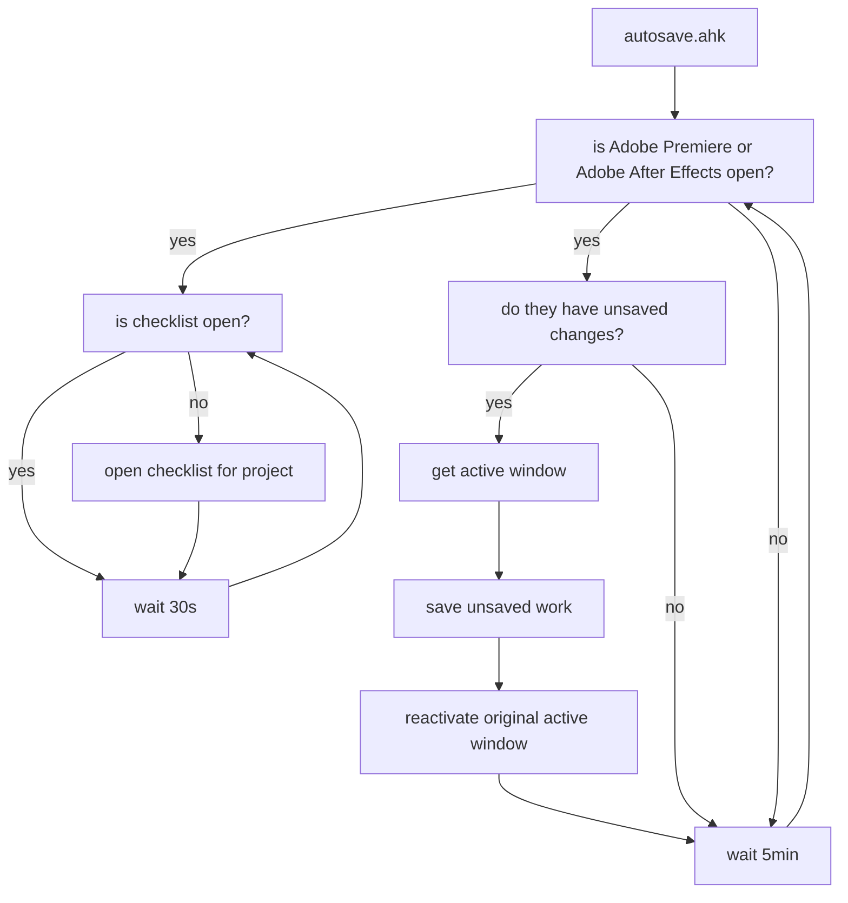

<div align="center">

# [](https://github.com/Tomshiii/ahk/tree/main) ahk
[](https://github.com/tomshiii/ahk/releases/latest) [](https://github.com/Tomshiii/ahk/commits/dev) [](https://github.com/tomshiii/ahk/blob/main/LICENSE)
</div>

This repo is a combination of all the scripts I use almost daily to help with either making content (videos or streaming related), or just speeding up mundane and random interactions with a computer.

- Video walking through [how to make sense of this repo](https://youtu.be/dSjpv_4bVCA)
- Video going over how AHK can help speed up [editing workflows](https://youtu.be/Iv-oR7An_iI)

<div align="center">

[ ](https://www.youtube.com/c/tomshiii)
</div>

A lot of the code in the earliest versions of my scripts was either inspired by, or taken from [Taran (previous editor for LTT)](https://github.com/TaranVH/). His videos on ahk got me into fiddling around with it myself so many thanks. These scripts were then further elaborated on, transformed into `ahk v2.0` compliant scripts and now mostly contains my own tinkerings. Any scripts directly from Taran are labeled as such down below in the Explanation section (do note though that I have personally gone through them to make them function in `ahk v2.0`).

You can watch me use some of these scripts in action whilst I edit away on twitch when I stream on my bot account:

<div align="center">

[ ](https://www.twitch.tv/botshiii)
</div>

### AHK Version Information:
This repo is to maintain work on the `ahk v2.0` versions of my scripts. These scripts **_will not_** work in `ahk v1.1`, the only versions of these scripts that will work with `ahk v1.1` are Releases [1.0](https://github.com/Tomshiii/ahk/releases/tag/v1.0)/[1.1](https://github.com/Tomshiii/ahk/releases/tag/v1.1)/[1.2](https://github.com/Tomshiii/ahk/releases/tag/v1.2) in this repo. They are _severely_ outdated, are practically missing everything found in the current versions of scripts, and those versions are no longer being maintained but you're free to try and backport any later additions if you're willing.

## QMK Keyboard:
My scripts have support for a secondary keyboard with [[QMK Keyboard.ahk]](https://github.com/Tomshiii/ahk/blob/main/QMK%20Keyboard.ahk) which along with the [`Hasu USB-USB converter`](https://geekhack.org/index.php?topic=109514.0) **OR** `a custom keyboard` (with `custom firmware`), allows you to use a secondary keyboard or numpad to launch completely different scripts than your main keyboard following [this tutorial by Taran from LTT](https://www.youtube.com/watch?v=GZEoss4XIgc). Any macros that have been moved to this script can be pulled out and placed in your own scripts without any issues.

## What to do:
1. Download and install [AHK v1.1](https://www.autohotkey.com/) then download [AHK v2.0 beta](https://www.autohotkey.com/v2/).
2. Extract AHK v2.0 beta, run the installer and then select `install for all users`
3. Download and install either; (You could technically just edit scripts in notepad if you really wanted to, but I honestly don't recommend it)
   - [Notepad++](https://notepad-plus-plus.org/downloads/)
     - Then download and install the [ahk language for notepad++](https://www.autohotkey.com/boards/viewtopic.php?t=50)
   - [VSCode](https://code.visualstudio.com/)
     - Then install an AHK extension within the program for a more complete package.
    ###### **_It is recommended you use VSCode as a lot of my variables have dynamic comments that can be viewed across the entire program that could help you understand what is going on._**
4. Download these scripts by either checking out the latest [release](https://github.com/tomshiii/ahk/releases/latest) or by cloning the repo (in either VSCode or your git manager of choice), then save them wherever you wish (I use "`E:\Github\ahk\`" if you want all the directory information to just line up without any editing) but if you wish to use a custom directory, my scripts should automatically adjust these variables when you run `My Scripts.ahk` but if you wish to do a sanity check, check the `working dir` value in `A_MyDocuments \tomshi\settings.ini` and if it lines up with your directory everything should work as intended.
    ###### **_Although do note; some [`Streamdeck AHK`](https://github.com/Tomshiii/ahk/tree/main/Streamdeck%20AHK) scripts still have hard coded dir's as they are intended for my workflow and may error out if you try to run them from a different location._**
5. Take a look at [Keyboard Shortcuts.ini](https://github.com/Tomshiii/ahk/tree/main/lib/KSA) to set your own keyboard shortcuts for programs as well as define some coordinates for a few remaining imagesearches that cannot use variables for various reason, these `KSA` values are used to allow for easy adjustments instead of needing to dig through scripts!
6. Run `My Scripts.ahk` to get started! (it's the main "hub" script)
7. You can then edit and run any of the .ahk files to use to your liking!
8. Adjust the `PC Startup.ahk` file ***or*** create shortcuts to individual scripts in your startup folder (which can be accessed by pressed `win + r` and then typing in `shell:startup`)
- If you don't have a secondary keyboard, don't forget to take a look through QMK Keyboard.ahk to see what functions you can pull out and put on other keys!

#### Then be aware:
- Any scripts that still contain pixel coordinates instead of using variables (in either, `Click`, `MouseMove`, `ImageSearch`, `PixelSearch`, etc) rely not only on my monitor layout or the `coordinate mode` set, but also my workspace layout within premiere (or any applicable program) and will not necessarily work out of the box. They will require looking at the individual comments, as well as any accompanying AHK documentation (make sure you look at the ahk [v2.0](https://lexikos.github.io/v2/docs/AutoHotkey.htm) documentation and **NOT** the [v1.1](https://www.autohotkey.com/docs/AutoHotkey.htm) documentation) to get an idea of what is going on, then adjusting accordingly using `Window Spy` which gets installed alongside AHK.
- All keyboard shortcuts within programs like Adobe Premiere/After Effects/OBS, etc that I need within a macro (eg. `^+5` to `highlight the media browser` within Premiere, or `d` for `select clip at playhead`) are definied within the [Keyboard Shortcuts.ini](https://github.com/Tomshiii/ahk/tree/main/lib/KSA) file instead of just sending the shortcut itself, which are then assigned variables within the [Keyboard Shortcut Adjustments.ahk](https://github.com/Tomshiii/ahk/blob/main/lib/KSA/Keyboard%20Shortcut%20Adjustments.ahk) script that is then included in other scripts. Edit that ini file with your own keyboard shortcuts (and assign any new values in the ahk script as well) to get things to work.

## Explanation:

#### [Keyboard Shortcuts.ini/Keyboard Shortcut Adjustments.ahk](https://github.com/Tomshiii/ahk/tree/main/lib/KSA)
An ini file/ahk script combo for defining all keyboard shortcuts for programs that are then used within other scripts. Having them defined separately in an ini file allows for easy swapping of hotkeys without needing to dig through each and every macro/function that uses it. You do NOT need to run this ahk file, it is [`#Include(d)`](https://lexikos.github.io/v2/docs/commands/_Include.htm) in `Functions.ahk`

#### [My Scripts.ahk](https://github.com/Tomshiii/ahk/blob/main/My%20Scripts.ahk)
This script is the "central" script if you will. A lot of my windows scripts are here (and a hand full of scripts I use for editing).

This script will also go through a lot of important functions on boot. Some go through their function every boot of the script while some are more conditional;
- `generate()` - Handles creating a `settings.ini` file in `A_MyDocuments \tomshi\` directory that handles a few user adjustable settings in my scripts. These settings can be adjusted by right clicking on `My Scripts.ahk` and clicking `Settings` or by pulling up `settingsGUI()` (default hotkey is `win + F1`)
- `locationReplace()` - Handles replacing any instance of either my original working directory, or yours if you move my scripts to a new location. eg. on first run by the user this function will replace all instances of `E:\Github\ahk` with the directory you run the script
- `verCheck()` - This function can be found in a few of my scripts and will check to see if you're running a version of AHK that is compatible with my scripts
- `trayMen()` - Adds some tray menu items to the right click menu of `My Scripts.ahk`
- `updateChecker()` - Checks github to see if there is a new version of my scripts available and can automatically download it for you as well as backup your current script directory
- `firstCheck()` - Will check to see if this is the first time you're running my scripts and offer a helpful GUI to run you through a few things to get you going.
- `oldError()` - Will remove logs in `A_ScriptDir \Error Logs\` older than 30 days
- `adobeTemp()` - Will scan your adobe temp folders and delete them if they're larger than the user adjustable setting. This function also contains a custom folder for `After Effects` and will require the user to meddle with it for full functionality

#### [QMK Keyboard.ahk](https://github.com/Tomshiii/ahk/blob/main/QMK%20Keyboard.ahk)
A script to allow separate function for my secondary keyboard. A script originally created by [Taran](https://github.com/TaranVH/) that I've heavily modified to work for my own workflow and to function in ahk v2.0 (and cut down to only applicable buttons). Up until [Release v2.2.5.1](https://github.com/Tomshiii/ahk/releases/tag/v2.2.5.1) I used a small seconday numpad, but as of [Release v2.3+](https://github.com/Tomshiii/ahk/releases/tag/v2.3) I use a Planck Ez custom keyboard.
Check out [\Secondary Keyboard Files](https://github.com/Tomshiii/ahk/tree/main/Support%20Files/Secondary%20Keyboard%20Files) for more information on how that works.

#### [Functions.ahk](https://github.com/Tomshiii/ahk/blob/main/lib/Functions.ahk)
A sort of "hub" script that includes all [individual function files](https://github.com/Tomshiii/ahk/tree/main/lib/Functions) into it so that ***it*** can then be [`#Include(d)`](https://lexikos.github.io/v2/docs/commands/_Include.htm) in other scripts. You don't need to manually run this file.
A function is defined similar to;
```autohotkey
/**
 * These are comments that dynamically display information when displayed in VSCode,
 but also serve as general comments for anyone else
 * 
 * This function does something
 * @param variableX is a value you pass into the function
 * @param variableY is a variable who's value will be passed back once the function is complete
 * @param variableZ is a variable with a default value, it can be omitted
 */
func(variableX, &variableY, variableZ := "default")
{
  if variableX = Y
    return
  ...
  variableY := "value"
  if variableZ != "default"
    code(variableZ)
}
```
We then [`#Include`](https://lexikos.github.io/v2/docs/commands/_Include.htm) `Functions.ahk` in other scripts so we can achieve things like below;
```autohotkey
hotkey::
{
  func("variableValue", &variableYbutCalledAnything)
  ...
  MsgBox(variableYbutCalledAnything)
}
```
Note:
- `variableZ` doesn't have to be used and can be omitted from the function call
- An example of a function in this repo that passes back a variable & also uses defaults is [`isFullscreen()`](https://github.com/Tomshiii/ahk/blob/main/lib/Functions/Windows.ahk)

#### [gameCheck.ahk](https://github.com/Tomshiii/ahk/blob/main/Timer%20Scripts/gameCheck.ahk)
A script that will automatically suspend `My Scripts.ahk` when a game is detected to be the active window & then unsuspend it when the game is no longer active.


#### [autosave.ahk](https://github.com/Tomshiii/ahk/blob/main/Timer%20Scripts/autosave.ahk)
A script that will automatically save an Adobe Premiere Pro/After Effects project every 5min (if there have been unsaved changes) because Adobe's built in autosave is practically useless and fails to function a lot. It will also check to ensure the `checklist.ahk` for the current project is open.


#### [checklist.ahk](https://github.com/Tomshiii/ahk/blob/main/checklist.ahk)
A script that allows me to keep informed about what I have left to do on a video editing project as well as keeping track of the hours I've put into any individual project. This file gets run from this directory and then reads an autogenerated `checklist.ini` file in your project folder. This script has an accompanying script in `\Support Files` that allows you to quickly replace any in use checklist files.

#### [Multi-Instance Close.ahk](https://github.com/Tomshiii/ahk/blob/main/Timer%20Scripts/Multi-Instance%20Close.ahk)
A script that will periodically check for duplicate instances of any autohotkey scripts and close one of them. Even if you use `#SingleInstance Force` reloading scripts can sometimes cause a second instance to slip open. This script will hopefully mitigate the odd behaviour that occurs when this happens by closing any duplicates.

#### [adobe fullscreen check.ahk](https://github.com/Tomshiii/ahk/blob/main/Timer%20Scripts/adobe%20fullscreen%20check.ahk)
A script that will restore Premiere back to its normal fullscreen mode if it gets stuck in a strange "further fullscreen" mode where you lose access to its window controls as well as ruining a lot of other coordinates for scripts.

#### [Streaming.ahk](https://github.com/Tomshiii/ahk/tree/main/Stream)
A script I run as Admin while streaming to allow me to interact with obs via ahk (both need to be on the same elevation to interact).

#### [PC Startup.ahk](https://github.com/Tomshiii/ahk/blob/main/PC%20Startup.ahk)
A script that is run on PC startup to launch all my AHK scripts, as well as deal with some programs I need.

#### [Resolve_Example.ahk](https://github.com/Tomshiii/ahk/blob/main/Resolve_Example.ahk)
An example script for Davinci Resolve that has ported a few things from my premiere scripts to help you get started. This is very rough, thrown together and contains nowhere near the same amount of features.

#### [Alt_menu_acceleration_DISABLER.ahk](https://github.com/Tomshiii/ahk/blob/main/Timer%20Scripts/Alt_menu_acceleration_DISABLER.ahk)
A script from [Taran](https://github.com/TaranVH/) to disable the alt menu acceloration unless you _hold_ down the alt key.

#### [autodismiss error.ahk](https://github.com/Tomshiii/ahk/blob/main/Timer%20Scripts/autodismiss%20error.ahk)
A script from [Taran](https://github.com/TaranVH/) to remove an annoying dialogue box in premiere that treats you like a child.

#### [right click premiere.ahk](https://github.com/Tomshiii/ahk/blob/main/right%20click%20premiere.ahk)
A script originally from [Taran](https://github.com/TaranVH/) to [move the playhead](https://github.com/TaranVH/2nd-keyboard/blob/master/Taran's_Premiere_Mods/PREMIERE_MOD_Right_click_timeline_to_move_playhead.ahk) in premiere with the right mouse button. This script has been heavily altered and contains a large amount of my own code

#### [\Error Logs](https://github.com/Tomshiii/ahk/tree/main/Error%20Logs)
Anytime a macro/script encounters an error it will be logged in a txt file in this directory to help you catch anything that isn't working as intended so that in the event that the tooltip disappears too quickly, you can still dig in and see everything going on.

Eg.
```
15:58:38.367 // `audioDrag()` encountered the following error: "User hasn't opened the required bin"
// Script: `My Scripts.ahk`, Line: 643
```