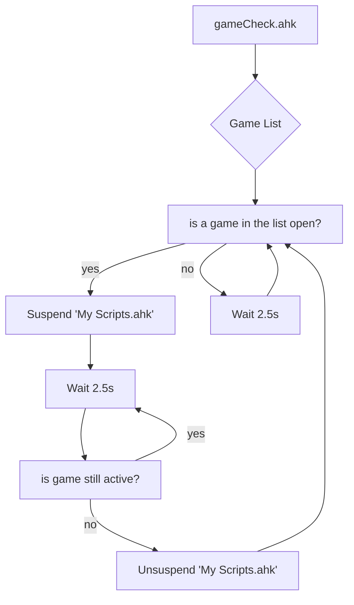

<div align="center">

# [](https://github.com/Tomshiii/ahk/tree/main) ahk
[](https://github.com/tomshiii/ahk/releases/latest) [](https://github.com/Tomshiii/ahk/commits/dev) [](https://github.com/tomshiii/ahk/blob/main/LICENSE)  
[![](https://img.shields.io/badge/v26.2+-21218f.svg?logo=)]() [![](https://img.shields.io/badge/v22.6+-21218f.svg?logo=)]()
</div>

This repo is a combination of all the scripts I use almost daily to help with either making content (videos or streaming related), or just speeding up mundane and random interactions with a computer.

The roots of this repo were heavily inspired by [Taran (previous editor for LTT)](https://github.com/TaranVH/). His videos on ahk got me into fiddling around with it myself. I have continued to iterate and expand my repo since then into the extensive repo you see today.

> [!Important]
> *A lot* of the development for this repo happens in the [dev](https://github.com/Tomshiii/ahk/tree/dev) branch before making its way into a release and these changes can remain over there for months at a time. I recommend checking out any [changes](https://github.com/Tomshiii/ahk/blob/dev/changelog.md) over there in case of important fixes, as well as the [Known Issues & Planned Changes](https://github.com/users/Tomshiii/projects/1) project page to see if any small bugs/changes are currently being tracked/worked on.  
> ***However*** do be aware that the dev branch **is** in active development and any number of bugs/issues may still be present as I continue to iron things out.

> [!Caution]
> A lot of code in this repo makes use of [UIA](https://github.com/Tomshiii/ahk/wiki/UIA) and amongst those code snippets there are tonnes of instances of hardcoded values that are assummed to be in english. If your installation of windows, or any relevant programs are in another language you may encounter issues.

***

## [Getting Started:](https://github.com/Tomshiii/ahk/wiki)

### Prerequisites:
> [!Warning]
> `nodejs` & `PremiereRemote` are both **requirements** for my repo's functionality. As of `Release v2.18.0` they will both be installed alongside my repo.

Depending on which sections of my repo you intend to use will determine how much manual setup is required from the user; For indepth instructions on how to get started with my repo, alongside any important notices head [over to the wiki page](https://github.com/Tomshiii/ahk/wiki).  
There you will also find complete definitions of all scripts/functions of my repo, important prerequisite information that is required of the user before my repo will function as expected, as well as detailed [installation instructions](https://github.com/Tomshiii/ahk/wiki/Installation).

### AHK Version Information:
This repo is designed and maintained to work in the `ahk v2.0`. They will not function in versions below `v2.0` and will likely have issues in the `v2.1 alpha` as well.
***

## Short Explanation:

#### [Libs](https://github.com/Tomshiii/ahk/tree/main/lib/)
In this section of the repo you will find a collection of lib files containing helpful functions, classes, GUIs & more! Some scripts rely on other lib files to function properly so make sure you pay attention to the top of each script, if it has any `#Include lib\path.ahk` then you will also need that file for the script to function properly!  
Do note however that my scripts are designed and written to expect files to be where they're placed during the installation process of my repo. If you try to pluck out individual classes/code do so at your own risk and expect to run into some problems.

#### [ My Scripts.ahk](https://github.com/Tomshiii/ahk/blob/main/My%20Scripts.ahk)
This script is main script I use to define all of my own hotkeys. It is not recommended for the user to simply run my version of this script and it is highly encouraged that they create their own instead.

#### [ QMK Keyboard.ahk](https://github.com/Tomshiii/ahk/blob/main/QMK%20Keyboard.ahk)
My scripts have support for a secondary keyboard with [[QMK Keyboard.ahk]](https://github.com/Tomshiii/ahk/blob/main/QMK%20Keyboard.ahk) which along with the [`Hasu USB-USB converter`](https://geekhack.org/index.php?topic=109514.0) **OR** `a custom keyboard` (with `custom firmware`), allows you to use a secondary keyboard or numpad to launch completely different scripts than your main keyboard following [this tutorial by Taran from LTT](https://www.youtube.com/watch?v=GZEoss4XIgc). Any macros that have been moved to this script can be pulled out and placed in your own scripts without any issues.  
[QMK Keyboard.ahk](https://github.com/Tomshiii/ahk/blob/main/QMK%20Keyboard.ahk) is therefor a script to allow separate function for my secondary keyboard. A script originally created by [Taran](https://github.com/TaranVH/) that I've heavily modified to work for my own workflow and to function in ahk v2.0 (and cut down to only applicable buttons). Up until [Release v2.2.5.1](https://github.com/Tomshiii/ahk/releases/tag/v2.2.5.1) I used a small seconday numpad, but as of [Release v2.3+](https://github.com/Tomshiii/ahk/releases/tag/v2.3) I use a `Planck Ez` custom keyboard.
Check out [\Secondary Keyboard Files](https://github.com/Tomshiii/ahk/tree/main/Support%20Files/Secondary%20Keyboard%20Files) for more information on how that works.

#### [ gameCheck.ahk](https://github.com/Tomshiii/ahk/blob/main/Timer%20Scripts/gameCheck.ahk)
A script that will automatically suspend `My Scripts.ahk` when a game is detected to be the active window & then unsuspend it when the game is no longer active.

```mermaid
  graph TD;
      A[gameCheck.ahk]-->B{Game List};
      B --> C[is a game in the list open?];

      C -- yes --> D[Suspend 'My Scripts.ahk']
      C -- no --> E[Wait 2.5s] --> C

      D --> H --> F[is game still active?]
      F -- yes --> H[Wait 2.5s]
      F -- no --> G[Unsuspend 'My Scripts.ahk']
      G --> C
```

#### [ autosave.ahk](https://github.com/Tomshiii/ahk/blob/main/Timer%20Scripts/autosave.ahk)
A script that will automatically save an Adobe Premiere Pro/After Effects project every 5min (if there have been unsaved changes) because Adobe's built in autosave is practically useless and fails to function a lot.


#### [ Multi-Instance Close.ahk](https://github.com/Tomshiii/ahk/blob/main/Timer%20Scripts/Multi-Instance%20Close.ahk)
A script that will periodically check for duplicate instances of any autohotkey scripts and close one of them. Even if you use `#SingleInstance Force` reloading scripts can sometimes cause a second instance to slip open. This script will hopefully mitigate the odd behaviour that occurs when this happens by closing any duplicates.


#### [ Alt_menu_acceleration_DISABLER.ahk](https://github.com/Tomshiii/ahk/blob/main/Timer%20Scripts/Alt_menu_acceleration_DISABLER.ahk)
A script originally from [Taran](https://github.com/TaranVH/) to disable the alt menu acceleration unless you _hold_ down the alt key.

#### [ Premiere_RightClick.ahk](https://github.com/Tomshiii/ahk/blob/main/lib/Classes/Editors/Premiere_RightClick.ahk)
A script originally from [Taran](https://github.com/TaranVH/) to [move the playhead](https://github.com/TaranVH/2nd-keyboard/blob/master/Taran's_Premiere_Mods/PREMIERE_MOD_Right_click_timeline_to_move_playhead.ahk) in premiere with the right mouse button. This script has been heavily altered and now contains mostly my own code.

#### [\Error Logs](https://github.com/Tomshiii/ahk/tree/main/Logs/Error%20Logs)
Anytime a macro/script encounters an error it will be logged in a txt file in this directory to help you catch anything that isn't working as intended so that in the event that the tooltip disappears too quickly, you can still dig in and see everything going on.

Eg.
```
14:45:38.758 // `WinGetTitle` encountered the following error: "`ahk_class AE_CApplication_26.2`-- TargetError: Target window not found." | Script: `winget.ahk`, Line Number: 231
```
***
> [!Tip]
> Plenty more scripts can be found within this repo, feel free to check out the [wiki page](https://github.com/Tomshiii/ahk/wiki/Home) or just browse around for more!